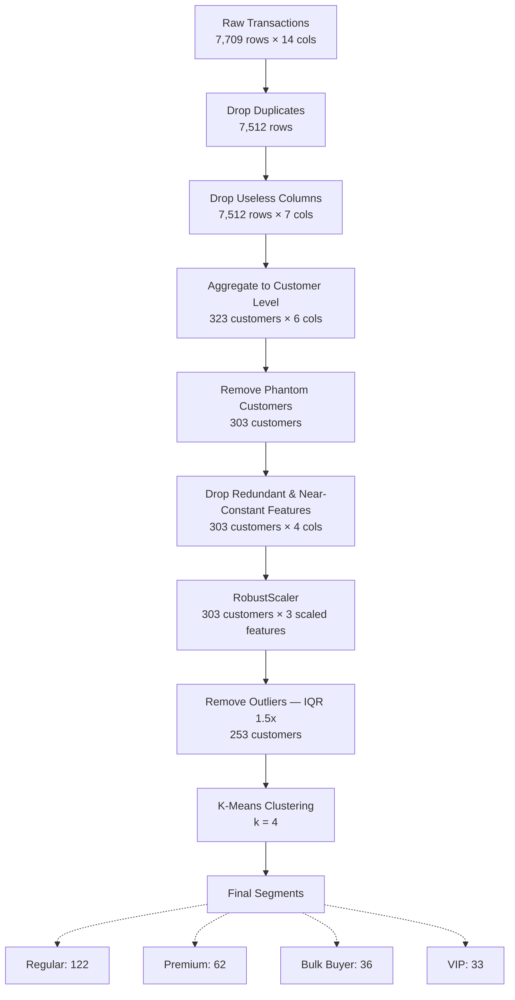
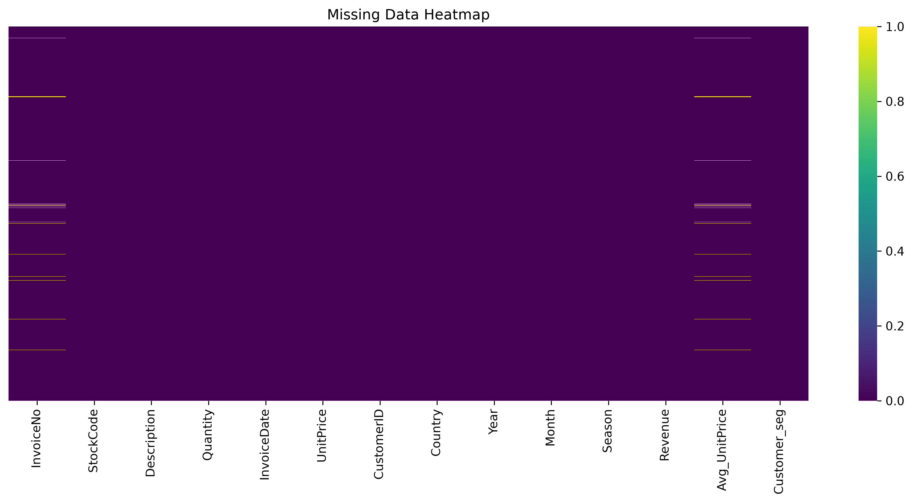
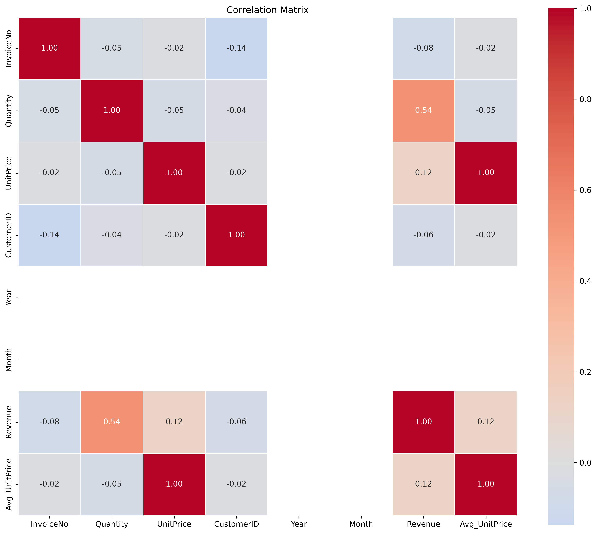
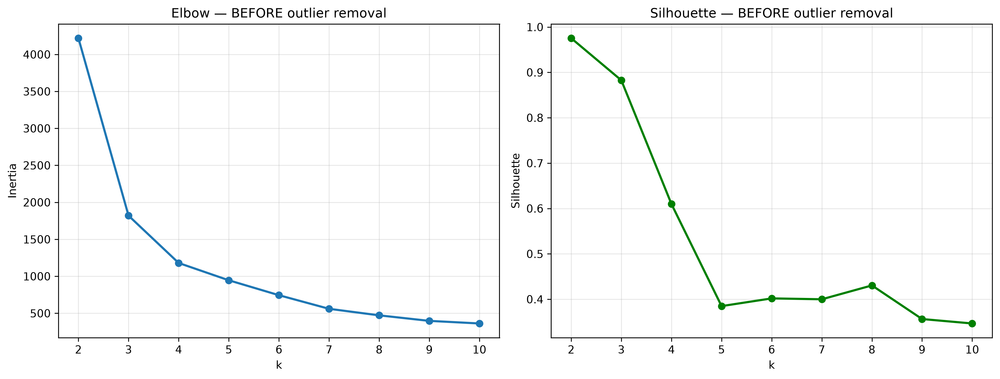
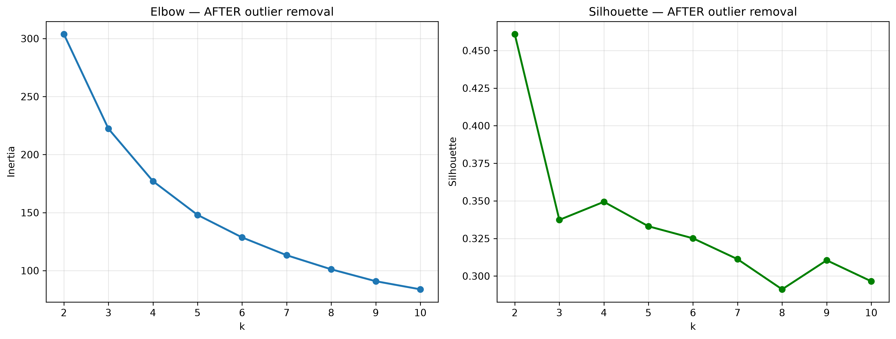
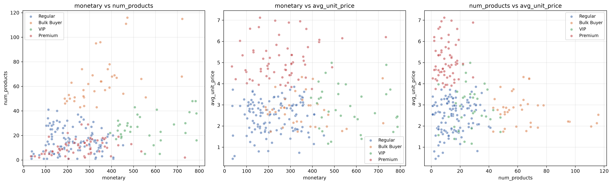

# Retail Customer Segmentation with K-Means

An end-to-end unsupervised learning pipeline that segments retail customers based on purchasing behavior to enable targeted marketing strategies.

## Overview / Business Problem

Customer segmentation allows businesses to identify distinct buying patterns and tailor their marketing, inventory, and engagement strategies accordingly. Rather than treating all shoppers identically, identifying segments — such as high-value VIPs, bulk buyers, or casual shoppers — helps maximize ROI on promotional campaigns. This project answers the question: *How can we group our customers into distinct, actionable behavioral segments using only their raw transaction history?*

## Dataset

- **Source:** Retail transaction records (invoices, products, quantities, prices, etc.).
- **Size:** 7,709 raw transaction rows × 14 columns.
- **Key Limitation:** The dataset covers a very short **5-day window** (December 1–5, 2022). Because of this narrow timeframe, traditional recency metrics (like "days since last purchase") lack meaningful variance and had to be excluded from the feature set.

## Project Pipeline

### 1. Exploratory Data Analysis (`part1_eda.py`)
- Analyzed missing values, duplicated rows, and overall data structure.
- Explored feature distributions and extreme outliers.
- Identified non-predictive/constant columns and rule-based leaky features to drop.

### 2. Preprocessing (`part2_preprocessing.py`)
- Dropped useless columns and duplicate records.
- Aggregated the transaction-level data up to the **customer level**, engineering features like total spend (`monetary`), basket variety (`num_products`), and typical item cost (`avg_unit_price`).
- Removed invalid customers (those with zero purchases due to full returns) to avoid creating "phantom" clusters.
- Scaled features using `RobustScaler` to prevent extreme spenders from dominating distance calculations.

### 3. Clustering (`part3_kmeans_clustering.py`)
- Filtered out extreme outliers (1.5× IQR) that were artificially skewing the K-Means clustering space.
- Used Elbow Method and Silhouette Scores to determine the optimal number of clusters (k = 4).
- Profiled and assigned business-friendly names to the resulting segments based on their defining traits (Regular, Bulk Buyer, VIP, Premium).

> **Results at a glance**
> - **253 customers** segmented into **4 groups**
> - Segments: Regular (48%), Premium (25%), Bulk Buyer (14%), VIP (13%)
> - Silhouette score: **0.35** (reasonable for behavioral segmentation)
> - Final dataset: `data/processed/customer_segments.csv`



## Key Decisions

- **`Customer_seg` & `Avg_UnitPrice`:** Dropped due to data leakage and perfect duplication. `Customer_seg` was a human-created rule on unit price; keeping it would simply validate an existing rule rather than discovering segments.
- **Aggregation Level:** Clustered at the customer level. Clustering at the transaction level produces purchase-line segments, which are not actionable for customer-level segmentation.
- **Recency:** Excluded. Since the data is constrained to a 5-day window, there was no meaningful variance to separate customers.
- **`total_quantity` & `frequency`:** `total_quantity` was highly correlated with `monetary` (r = 0.86), so it was dropped. `frequency` was dropped because it was near-constant (85.8% of customers had frequency = 1).
- **Scaling:** `RobustScaler` was chosen over `StandardScaler` because the `max/median > 10` for two key features, making it highly resistant to the remaining high-value VIP customers.
- **Outlier Handling:** Extreme outliers were intentionally preserved through preprocessing and only removed in the clustering phase, as removal is a modeling decision intended to focus the segmentation on the typical customer population.

## Choosing k

The optimal number of clusters was chosen using a combination of the Elbow method and Silhouette scores.

- The silhouette score at k = 2 was artificially high (0.98). This is a known artifact of K-Means attempting to isolate the extreme outlier tail into its own cluster, which does not represent true behavioral segmentation.
- k = 4 was chosen because the elbow bends distinctly at 4, and the silhouette score peaks (at ~0.35) within the meaningful range (k ≥ 3).

## Results — The 4 Customer Segments

| Segment | Size | Share | Avg Monetary | Avg Products | Avg Unit Price | Description |
|---------|------|-------|--------------|--------------|----------------|-------------|
| **VIP** | 33 | 13.0% | £562 | 26.6 | £2.89 | Highest-value customers |
| **Bulk Buyer** | 36 | 14.2% | £351 | 64.8 | £2.75 | Broad-basket buyers |
| **Premium** | 62 | 24.5% | £255 | 10.5 | £5.10 | Quality-focused, high price per item |
| **Regular** | 122 | 48.2% | £222 | 15.4 | £2.47 | Baseline customers |

### Business Recommendations

- **VIP** → Loyalty rewards, early access to new products, personalized offers.
- **Bulk Buyer** → Volume discounts, B2B/wholesale outreach.
- **Premium** → Promote new high-end products, emphasize quality over discounts.
- **Regular** → Retention campaigns, cross-sell, seasonal promotions.

## Visualizations

### Data Diagnostics



### Cluster Optimization



### Final Segmentation Profiles


## Project Structure

```
retail-customer-segmentation-kmeans/
├── data/
│   ├── README.md                    # setup instructions for the data folder
│   ├── raw/
│   │   └── .gitkeep                 # placeholder (raw data excluded from Git)
│   └── processed/
│       └── .gitkeep                 # placeholder (generated CSVs excluded from Git)
├── outputs/                         # all generated figures
│   ├── cluster_scatter_plots.png
│   ├── eda_3_missing_data_heatmap.png
│   ├── eda_6_distribution_*.png
│   ├── eda_9_correlation_matrix.png
│   ├── elbow_silhouette_before.png
│   └── elbow_silhouette_after.png
├── src/
│   ├── part1_eda.py
│   ├── part2_preprocessing.py
│   └── part3_kmeans_clustering.py
├── main.py
├── requirements.txt
├── .gitignore
└── README.md
```

## How to Run

1. **Install dependencies:**
   ```bash
   pip install -r requirements.txt
   ```

2. **Download the original dataset and put it here with this name:**
   ```bash
   data/raw/My_retail_data.csv
   ```

3. **Run this file and it will automatically run the entire pipeline:**
   ```bash
   python main.py
   ```

4. **View the results:** All figures are saved to the `outputs/` folder and the final `customer_segments.csv` is saved to `data/processed`.

## Limitations

- **Small dataset:** Only 253 customers remain after cleaning. Segment sizes are small, and statistical significance of the segments is limited.
- **Short time window:** The data covers only 5 days, so no seasonality or recency signal could be captured.
- **Clustering quality:** A silhouette score of ~0.35 indicates reasonable but not strong cluster separation — this is typical for real-world behavioral data.
- **Segment names are interpretations:** The labels ("VIP", "Premium", etc.) reflect our reading of the cluster profiles, not ground-truth business categories.

## Tech Stack

- Python 3
- pandas, numpy
- matplotlib, seaborn
- scikit-learn (KMeans, RobustScaler, silhouette_score)
```